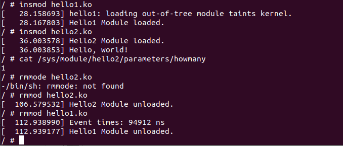
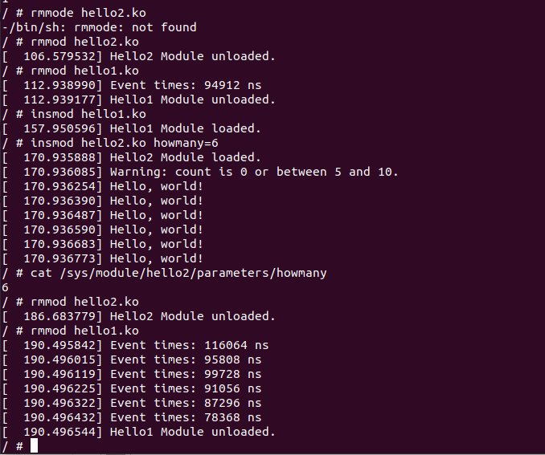
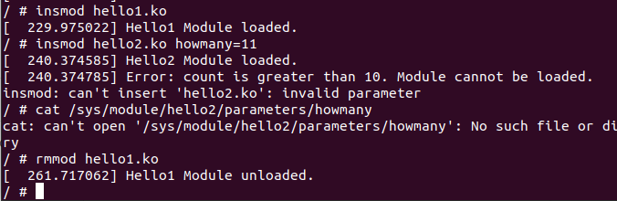
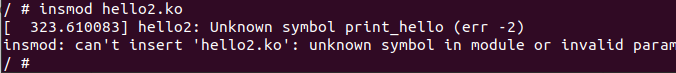
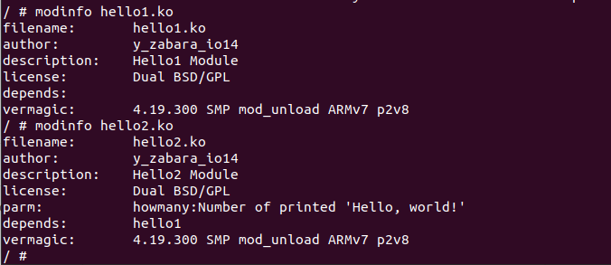

### Скріншоти виконання
- Завантажуємо модуль hello1.ko та hello2.ko без значення параметру

- Завантажуємо модуль hello1.ko та hello2.ko з значенням параметру 6

- Завантажуємо модуль hello1.ko  а  потім hello2.ko з значенням параметра 11

- Спочатку намагаємось завантажити hello2.ko а потім hello1.ko

На цьому моменті виникає помилка, тому що модуль hello2.ko намагається імпортувати функцію якої немає в таблиці символів ядра. Оскільки функція реалізована і експортується іншим модулем - потрібно спочатку завантажити модуль hello1 який і додасть символ  в публічну таблицю символів ядра, і вже після все повинно працювати
- Інформація про модулі                      

